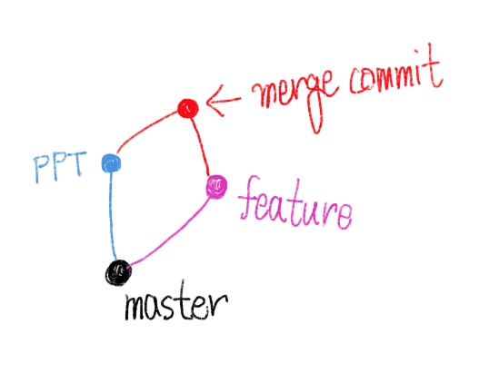

# branch 시나리오

## 준비

- 빈 프로젝트에 README.md 파일을 만들고, root commit을 발생시켜주세요.

## 시나리오

### 상황 1. fast-foward

> fast-foward는 feature 브랜치가 생성된 이후 master 브랜치에 변경 사항이 없는 상황

1. feature/test branch 생성 및 이동

   ```bash
   $ git branch feature/test
   $ git branch
     feature/test
   * master
   $ git checkout feature/test
   'feature/test' 브랜치로 전환합니다
   ```

2. 작업완료 후 commit

   ```bash
   $ touch test.txt
   $ git add .
   $ git commit -m 'complete test page'
   $ git log --oneline
   $ git commit -m 'complete test page'
   [feature/test d6972a4] complete test page
    1 file changed, 0 insertions(+), 0 deletions(-)
    create mode 100644 test.txt
   ```

3. master 이동

   ```bash
   $ git checkout master
   'master' 브랜치로 전환합니다
   ```

4. master에 병합

   ```bash
   $ git merge feature/test
   업데이트 중 0ce09a1..3a0c443
   Fast-forward
    test.txt | 0
    1 file changed, 0 insertions(+), 0 deletions(-)
    create mode 100644 test.txt
   ```

5. 결과 -> fast-foward (단순히 HEAD를 이동)

   ```bash
   $ git log --oneline
   d6972a4 (HEAD -> master, feature/test) complete test page
   376d09c init
   ```

6. branch 삭제

   ```bash
   $ git branch -d feature/test
   feature/test 브랜치 삭제 (과거 d6972a4).
   ```

---

### 상황 2. merge commit

> 서로 다른 이력(commit)을 병합(merge)하는 과정에서 다른 파일이 수정되어 있는 상황
>
> git이 auto merging을 진행하고 commit이 발생한다.

1. feature/main branch 생성 및 이동

   ```bash
   $ git checkout -b feature/main
   새로 만든 'feature/main' 브랜치로 전환합니다
   ```

2. 작업 완료 후 commit

   ```bash
   $ touch main.txt
   $ git add .
   $ git commit -m 'complete main'
   [feature/main c18b57a] complete main
    1 file changed, 0 insertions(+), 0 deletions(-)
    create mode 100644 main.txt
   $ git log --oneline
   c18b57a (HEAD -> feature/main) complete main
   d6972a4 (master) complete test page
   376d09c init
   ```

3. master 이동

   ```bash
   $ git checkout master
   'master' 브랜치로 전환합니다
   ```

4. master에 추가 commit 발생시키기

   - 다른 파일을 수정 혹은 생성

     ```bash
     $ touch hotfix.txt
     $ git add .
     $ git commit -m 'hotfix'
     [master e20abab] hotfix
      1 file changed, 0 insertions(+), 0 deletions(-)
      create mode 100644 hotfix.txt
     $ git log --oneline
     e20abab (HEAD -> master) hotfix
     d6972a4 complete test page
     376d09c init
     ```

5. master에 병합

   ```bash
   $ git merge feature/main
   Merge made by the 'recursive' strategy.
    main.txt | 0
    1 file changed, 0 insertions(+), 0 deletions(-)
    create mode 100644 main.txt
   ```

6. 결과 -> 자동으로 merge commit 발생

   - vim 편집기 화면이 나타남.
   - 자동으로 작성된 commit 메시지를 확인하고 `esc`를 누른 후 `:wq`를 입력하여 저장 및 종료.
     - w: wirte
     - q: quit
   - commit 확인

7. 그래프 확인하기

   ```bash
   $ git log --oneline --graph
   *   412e4ff (HEAD -> master) Merge branch 'feature/main'
   |\  
   | * c18b57a (feature/main) complete main
   * | e20abab hotfix
   |/  
   * d6972a4 complete test page
   * 376d09c init
   ```

8. branch 삭제

   ```bash
   $ git branch -d feature/main
   feature/main 브랜치 삭제 (과거 c18b57a).
   ```

---

### 상황 3. merge commit 충돌

> 서로 다른 이력(commit)을 병합(merge)하는 과정에서 동일 파일이 수정되어 있는 상황
>
> git이 auto merging을 하지 못하고, 해당 파일의 위치에 라벨링을 실시.
>
> 원하는 형태의 코드로 직접 수정을 하고 merge commit을 발생 시켜야 함.

1. Feature/sub branch 생성 및 이동

   ```bash
   $ git checkout -b feature/sub
   새로 만든 'feature/sub' 브랜치로 전환합니다
   ```

2. 작업 완료 후 commit

   ```bash
   $ touch sub.txt
   $ git add .
   $ git commit -m 'complete sub'
   [feature/sub 6d4df3e] complete sub
    1 file changed, 0 insertions(+), 0 deletions(-)
    create mode 100644 sub.txt
   $ git log --oneline
   6d4df3e (HEAD -> feature/sub) complete sub
   412e4ff (master) Merge branch 'feature/main'
   e20abab hotfix
   c18b57a complete main
   d6972a4 complete test page
   376d09c init
   ```

   ```bash
   # => READ.md를 열어서 문구 자유롭게 추가
   $ git status
   현재 브랜치 feature/sub
   커밋하도록 정하지 않은 변경 사항:
     (무엇을 커밋할지 바꾸려면 "git add <파일>..."을 사용하십시오)
     (use "git restore <file>..." to discard changes in working directory)
   	수정함:        README.md
   
   커밋할 변경 사항을 추가하지 않았습니다 ("git add" 및/또는 "git commit -a"를
   사용하십시오)
   $ git add .
   $ git commit -m 'update README'
   [feature/sub 2a1c7d8] update README
    1 file changed, 2 insertions(+)
   ```

3. master 이동

   ```bash
   git checkout master
   ```

4. master에 추가 commit 발생시키기

   - 동일 파일을 수정 혹은 생성

     ```bash
     # README.md 파일 수정
     $ git status
     현재 브랜치 master
     커밋하도록 정하지 않은 변경 사항:
       (무엇을 커밋할지 바꾸려면 "git add <파일>..."을 사용하십시오)
       (use "git restore <file>..." to discard changes in working directory)
     	수정함:        README.md
     $ git add .
     $ git commit -m 'update README@master'
     [master f021555] update README@master
      1 file changed, 3 insertions(+)
     $ git log --oneline
     f021555 (HEAD -> master) update README@master
     412e4ff Merge branch 'feature/main'
     e20abab hotfix
     c18b57a complete main
     d6972a4 complete test page
     376d09c init
     ```

5. master에 병합

   ```bash
   $ git merge feature/sub
   자동 병합: README.md
   충돌 (내용): README.md에 병합 충돌
   자동 병합이 실패했습니다. 충돌을 바로잡고 결과물을 커밋하십시오.
   ```

6. 결과 -> merge conflict 발생

   ```bash
   $ git status
   현재 브랜치 master
   병합하지 않은 경로가 있습니다.
     (충돌을 바로잡고 "git commit"을 실행하십시오)
     (병합을 중단하려면 "git merge --abort"를 사용하십시오)
   
   커밋할 변경 사항:
   	새 파일:       sub.txt
   
   병합하지 않은 경로:
     (해결했다고 표시하려면 "git add <파일>..."을 사용하십시오)
   	양쪽에서 수정:  README.md
   ```

7. 충돌 확인 및 해결

   ```bash
   # README 파일 열어보기
   <<<<<<< HEAD
   
   
   master readread
   =======
   
   Readread
   
   >>>>>>> feature/sub
   ```

8. merge commit 진행

   ```bash
   # README 파일 내가 원하는 방향으로 수정 후
   $ git add .
   $ git commit
   ```

   - vim 편집기 화면이 나타남.
   - 자동으로 작성된 commit 메시지를 확인하고 `esc`를 누른 후 `:wq`를 입력하여 저장 및 종료.
     - w: wirte
     - q: quit
   - commit 확인

9. 그래프 확인하기

   ```bash
   $ git log --oneline --graph
   *   7f19b13 (HEAD -> master) Merge branch 'feature/sub'
   |\  
   | * 2a1c7d8 (feature/sub) update README
   | * 6d4df3e complete sub
   * | f021555 update README@master
   |/  
   *   412e4ff Merge branch 'feature/main'
   |\  
   | * c18b57a complete main
   * | e20abab hotfix
   |/  
   * d6972a4 complete test page
   * 376d09c init
   ```

10. branch 삭제

    ```bash
    $ git branch -d feature/sub
    feature/sub 브랜치 삭제 (과거 2a1c7d8).
    ```

## 정리 (예시)

- 상황 1: 프리라이딩 (fast-foward) => 그냥 내가 한 것을 제출 


- 상황 2: 보고서 + PPT (merge commit) => A의 보고서와 B의 PPT를 합쳐서 제출



- 상황 3: PPT + PPT (merge conflict) => 목차를 수정하여 제출


